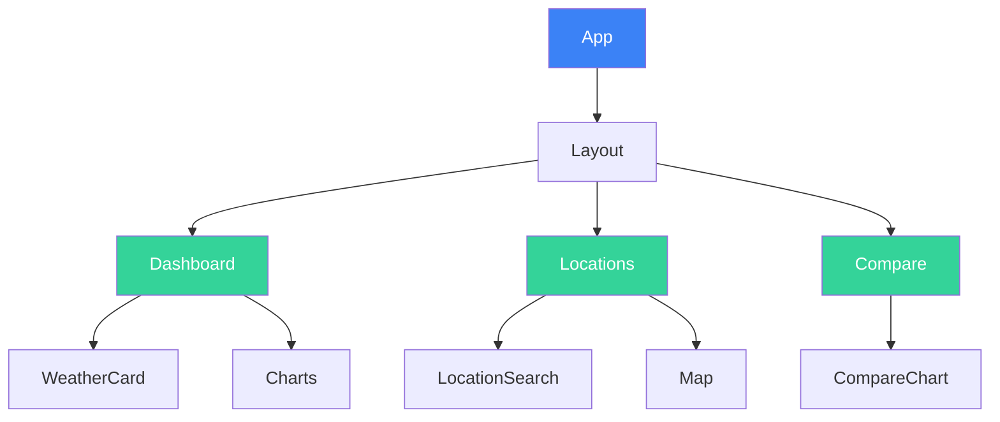
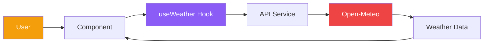
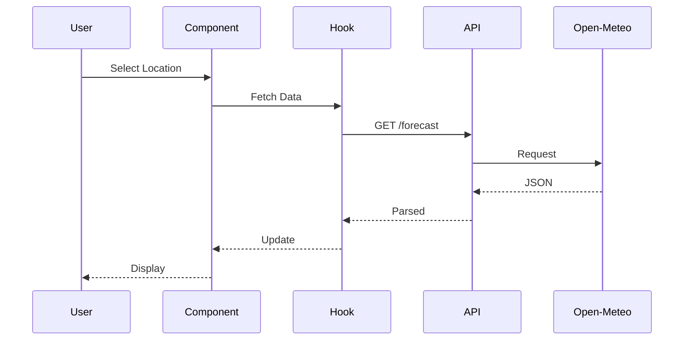
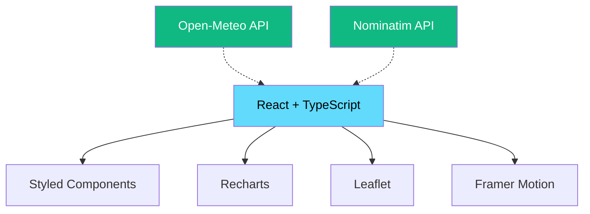

# WeatherHub - Diagrams
---

## 1. Component Architecture

```mermaid
graph TD
    A[App] --> B[Layout]
    B --> D[Dashboard]
    B --> E[Locations]
    B --> F[Compare]

    D --> D1[WeatherCard]
    D --> D2[Charts]
    E --> E1[LocationSearch]
    E --> E2[Map]
    F --> F1[CompareChart]

    style A fill:#3b82f6,color:#fff
    style D fill:#34d399,color:#fff
    style E fill:#34d399,color:#fff
    style F fill:#34d399,color:#fff
```

---

## 2. Data Flow

```mermaid
flowchart LR
    A[User] --> B[Component]
    B --> C[useWeather Hook]
    C --> D[API Service]
    D --> E[Open-Meteo]
    E --> F[Weather Data]
    F --> B

    style A fill:#f59e0b,color:#fff
    style C fill:#8b5cf6,color:#fff
    style E fill:#ef4444,color:#fff
```

---

## 3. API Flow (Sequence)

```mermaid
sequenceDiagram
    User->>Component: Select Location
    Component->>Hook: Fetch Data
    Hook->>API: GET /forecast
    API->>Open-Meteo: Request
    Open-Meteo-->>API: JSON
    API-->>Hook: Parsed
    Hook-->>Component: Update
    Component-->>User: Display
```

---

## 4. Tech Stack

```mermaid
graph TB
    A[React + TypeScript] --> B[Styled Components]
    A --> C[Recharts]
    A --> D[Leaflet]
    A --> E[Framer Motion]

    F[Open-Meteo API] -.-> A
    G[Nominatim API] -.-> A

    style A fill:#61dafb,color:#000
    style F fill:#10b981,color:#fff
    style G fill:#10b981,color:#fff
```
